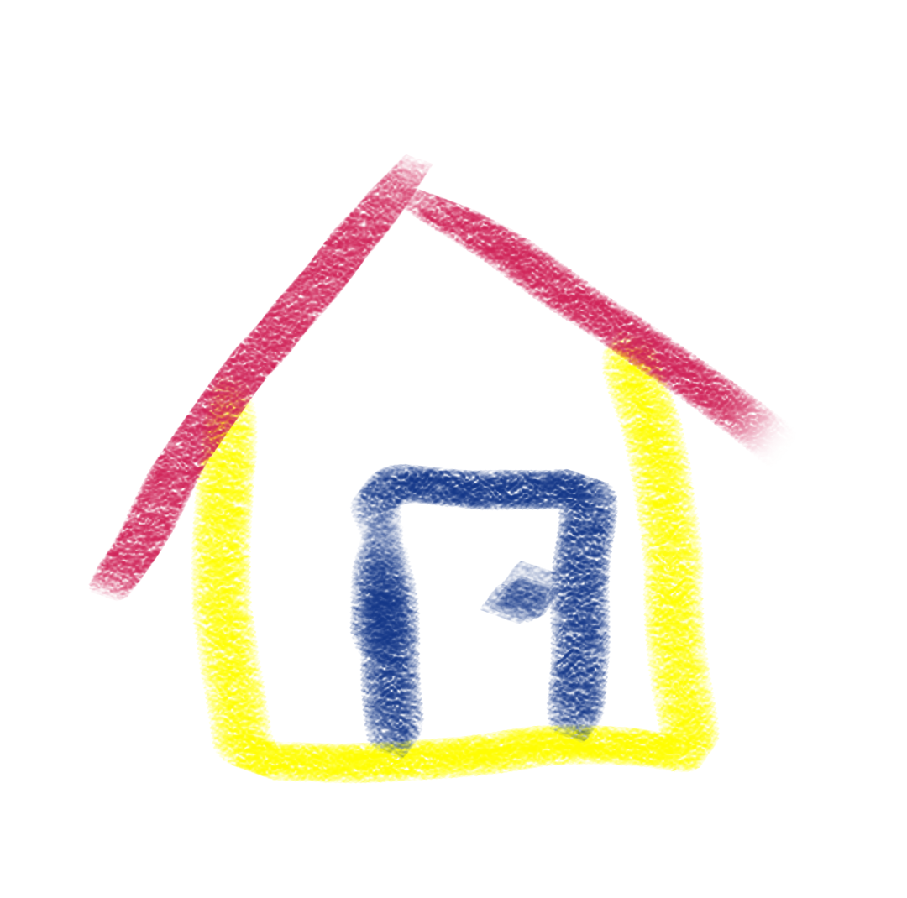
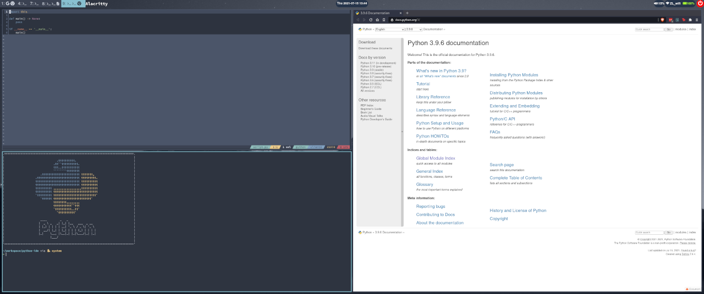
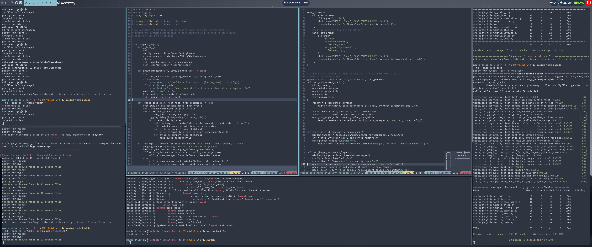

# reZIDE [![Tests][tests-badge]][tests-link] [![Codecov][coverage-badge]][coverage-link] [![PyPI][pypi-badge]][pypi-link]

_a comfy custom IDE where you can feel right at home_ 🏡

Use simple, declarative configuration files to create complex IDEs with a single command!

## What's it like?
Think of it like any available [IDE](https://www.jetbrains.com/pycharm/), except:

* You can read and write your configurations easily in [TOML format](https://toml.io/en/)
* You can use any program that you prefer without waiting for anyone else to add a plugin/integration. If you can run it on your command line, you can run it in `reZIDE`! Editors, linters, autoformatters, typecheckers, ASCII movies, distracting videos, etc...
* You can share your configurations with others
* You can copy/learn from others' configurations

Or think of it like [tmux](https://www.ocf.berkeley.edu/~ckuehl/tmux/), except:

* You don't need to learn new movement commands (use the commands that you already use for your window manager)
* You aren't restricted to applications with a Terminal User Interface (you can open web browsers, pdf previews, video players, etc.)

## What's it stand for?
```
⬅️⬅️(Zach's)
⬇️   really
⬇️   enjoyable
➡️➡️ Z
     Integrated
     Development
     Environment
```

Because that's how acronyms work.

Credits to @hyangda for brainstorming this great name with me 😄
## Screencap
(insert cool screencap here)

(this one's just a placeholder)

Click to go to Youtube!

[](https://youtu.be/g_AgwusS9m8)

## Requirements
### One of these tiling window managers:

- [x] [sway](https://swaywm.org/)
- [ ] [i3](https://i3wm.org/) (it should work out of the box, but I'm too lazy to install i3 just to test this. if you can confirm on my behalf, please check this box and submit a PR!)

### At least 1 configuration file
See [examples](examples/).

## Installation
I recommend using [pipx](https://pypa.github.io/pipx/) for environment isolation:
```
pipx install reZIDE
```

You can also use [pip](https://pip.pypa.io/en/stable/installing/) if you don't mind modifying your system Python environment:
```
pip install reZIDE
```

## How to use
Run this command for documentation on how to use `reZIDE`:
```
rzd --help
```


## Motivation
[Tiling window managers](https://youtu.be/GKviflL9XeI) are powerful and flexible and I love using them. However, I kept finding myself running into one issue: *I'm lazy.*

Whenever I sit down to work, I usually want to open a group of 2+ windows. Each window takes 5s-30s to get to a useful state. That's way too much effort. I couldn't be bothered.

Here are some groups of windows (AKA **layouts**) that I commonly use:

### python mode
* editor for source code
* editor for tests
* browser for documentation/tickets
* terminal for arbitrary commands like linting, running tests, and installing packages

### web dev mode
* editor for source code
* editor for tests
* small terminal running linter
* small terminal using a filewatcher to run tests
* small terminal running the typescript compiler
* medium terminal for running arbitrary commands

### documentation mode
* editor for document
* browser/pager for source material
* terminal for compiling document into pdf
* pdf viewer for viewing compiled pdf

It usually takes at least 10 keystrokes to run a command (even with tab-completion and fuzzy-finding) and then another 5-15 keystrokes to resize the window so that it's as big or small as I want. Here's an example:

### Spawning and resizing a single window
* `<super-enter>` to open a terminal
* [cdd](https://github.com/abstractlyZach/dotfiles/blob/master/shell_functions#L3-L13) to `cd` but with fuzzy-finding
* type `rez` to get `~/workspace/abstractlyZach/reZIDE/` to show up as the first result
* `<enter>`
* `fd | entr make typecheck<enter>` to automatically run my typechecker whenever files change
* `<super-r>` to enter "resize" mode
* `left x5` to make the window smaller
* `<esc>` to exit "resize" mode

And then I have to do that like 5 more times; that's too much work! 😤 I'm losing seconds of productivity every day just opening, commanding, and resizing windows!

<!-- TODO: create a Motivation Part 2 document and move this there -->
<!-- There were also a lot of consistent configurations that I wanted to use that just wouldn't
work out of the box. I like splitting my monitor up with 25-50-25 or 20-60-20 ratios and
that requires a lot of manual resizing. I could also set up elaborate rules in Sway and
then make sure each window fits into those rules, but I don't even know how that would work
since Sway can resize floating windows or existing windows, but an IDE that creates itself
in an instant wouldn't have any existing windows. And rules affect windows at window creation
so it's like a chicken-and-egg problem
-->


## Goals
* use only i3/sway to manage windows
* create a DIY IDE with a single command
* allow different IDEs to be defined through a readable file (like TOML)
* run arbitrary commands (not just shells and TUIs!)

## Defining an IDE in TOML

### Basic Python IDE
This [Python](https://www.python.org/) IDE has a relatively basic TOML file. Here's what the final product looks like:


```toml
# python IDE
[python]

# tells reZIDE that this is a layout and it should construct a tree out of it and its descendants
is_layout = true

# this is what % of the screen each child should take up
# in this case, it's a 50-50 split
sizes = [50, 50]

# tells reZIDE the names of the Windows and Sections that belong in the "python" Section
# reZIDE will look up these Window and Section definitions elsewhere in this file and
#   build them appropriately
# so here, we have terminals on the left side and documentation on the right side
children = ['terminals', 'documentation']

# the screen should be split horizontally so that the children are to the left and right
#   of each other
split = "horizontal"


[terminals]
sizes = [50, 50]
children = ['python-editor', 'python-gutter']
split = 'vertical'

# our first Window definition
[python-gutter]

# run this command to:
# * spawn an alacritty window
# * set the working directory to ~/workspace/python-ide/
# * print some ascii art onto the terminal
# * start a zsh interactive shell
command = """
    alacritty \
        --working-directory ~/workspace/python-ide/ \
        -e sh -c 'cat python.logo.colored.asciiart; zsh'
"""

# mark this window in the window manager as 'python-gutter'
mark = 'python-gutter'


[python-editor]
command = """
    alacritty \
        --working-directory ~/workspace/python-ide/ \
        -e sh -c 'cp script_template.py script.py; kak script.py; zsh'
"""
mark = 'python-editor'

[documentation]
command = "brave --new-window https://docs.python.org/3/"
mark = 'documentation'

```

### A complexer IDE
This IDE gives us everything we need to have a smooth development session when working on the `reZIDE` project.

Try opening the screenshot in another tab/window and see if you can match all of the Window/Section definitions in the TOML file to their corresponding areas on the screenshot!



```toml
# more-complicated IDE for developing the reZIDE source code
[rezide-ide]
is_layout = true
split = "horizontal"
children = ['linters', 'main', 'tests']
sizes = [20, 60, 20]

# 1st level
# ---------------------------------------------------------------------------------------
[linters]
split = "vertical"
sizes = [50, 50]
children = ['formatting', 'typechecking']

[main]
split = "vertical"
children = ['editors', 'gutter']
sizes = [70, 30]

[tests]
command = """
    alacritty \
        --working-directory ~/workspace/abstractlyZach/reZIDE/ \
        -e sh -c 'fd | entr make test; zsh'
"""
mark = "tests"

# 2nd level
# ---------------------------------------------------------------------------------------

[formatting]
command = """
    alacritty \
        --working-directory ~/workspace/abstractlyZach/reZIDE/ \
        -e sh -c \
            'fd | entr sh -c \"echo && make format && make lint && echo_success\"; zsh'
"""
mark = "formatting"

[typechecking]
command = """
    alacritty \
        --working-directory ~/workspace/abstractlyZach/reZIDE/ \
        -e sh -c 'fd | entr make typecheck; zsh'
"""
mark = "typechecking"

[editors]
sizes = [50, 50]
children = ['left-editor', 'right-editor']
split = "horizontal"

[gutter]
command = """
    alacritty \
        --working-directory ~/workspace/abstractlyZach/reZIDE/ \
        -e sh -c 'neofetch; zsh'
"""
mark = "gutter"

# 3rd level
# ---------------------------------------------------------------------------------------
[left-editor]
command = """
    alacritty \
        --working-directory ~/workspace/abstractlyZach/reZIDE/ \
        -e sh -c 'kak src/rezide/rezide.py'
"""
mark = "left-editor"

[right-editor]
command = """
    alacritty \
        --working-directory ~/workspace/abstractlyZach/reZIDE/ \
        -e sh -c 'kak README.md'
"""
mark = "right-editor"
```

## Shell Completion
[Setting up completion for your shell](completions)


## Alternatives
* [tmux](https://github.com/tmux/tmux)
* anything by jetbrains lul

[pypi-badge]:       https://img.shields.io/pypi/v/reZIDE.svg
[pypi-link]:        https://pypi.org/project/reZIDE/
[tests-badge]:      https://github.com/abstractlyZach/reZIDE/workflows/Tests/badge.svg
[tests-link]:       https://github.com/abstractlyZach/reZIDE/actions?workflow=Tests
[coverage-badge]:   https://codecov.io/gh/abstractlyZach/reZIDE/branch/main/graph/badge.svg
[coverage-link]:    https://codecov.io/gh/abstractlyZach/reZIDE
